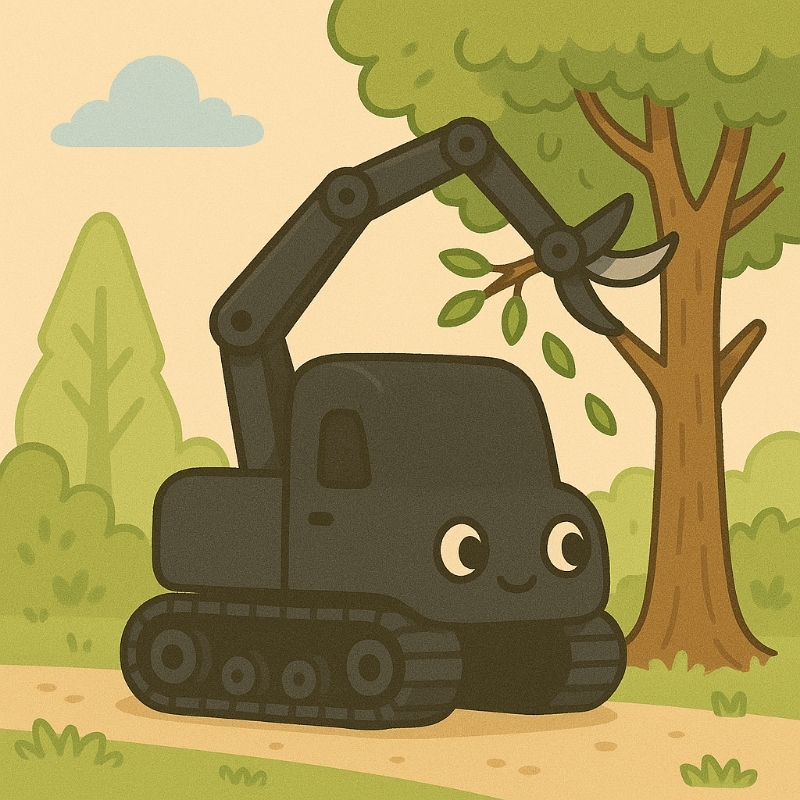

# Team18 Real-Time Embedded Project

## **Plant Protection Robot**

A smart agricultural robot based on **Raspberry Pi 5** and the **Adeept robot kit**, designed for remote plant monitoring, pest deterrence, obstacle detection, and web-based control. The system leverages **event-driven architecture**, efficient I/O scheduling, and multi-protocol hardware interfaces to achieve reliable and responsive operation.



---

### Key Features

- **Real-time Video Monitoring**  
  Uses the Raspberry Pi Camera v2 with the open-source library [libcamera2opencv](https://github.com/berndporr/libcamera2opencv) to capture frames and convert them directly into OpenCV cv::Mat format. These frames are then streamed as MJPEG via an embedded HTTP server.

- **Pest Deterrence with Smart Arm**  
  Controls a 4-DOF robotic arm powered by **Waveshare serial bus servos**, communicating via **USB serial** for improved power stability and precise movements.

- **Sensor Data via Event-Driven Timers**  
  Periodic sensor updates driven by `TimerFD`, including:
  - Battery voltage monitoring via **ADS7830** ADC
  - Obstacle distance via **HC-SR04** ultrasonic sensor
  - System stats: CPU load, memory usage, and temperature

- **Tracked Chassis Drive System**  
  Uses **PCA9685 PWM controller** to generate signals for **DRV8833 motor drivers**, enabling forward, backward, and turning motions via DC motors.

- **🌿Web-based Control Interface**  
The UI remains responsive and continuously updates via **WebSocket**connections, ensuring real-time synchronization of all system metrics and status indicators.

Accessible via any web browser, the UI displays:

- **🔐Login System Interface
Users must log in with a username and password:
- Username: `robot`  
- Password: `robot`
- **🚗 Movement Controls
Movement control through directional buttons to control the robot.
- **🤖 Mechanical Arm Operations (Tabbed Interface)
- Movement tab: Controls vertical and forward/backward arm movement  
- Clamp tab: Controls the clamp for cutting, releasing, and rotation
- **📷 Live Camera and Screenshots
- Displays the robot’s live video stream  
- Camera control buttons for up/down movement  
- Supports timestamped screenshots with a scrolling gallery
- **📊 System Status
- Distance measurements from the ultrasonic sensor via gauge  
- System resource monitoring: Battery information/CPU temperature and usage/RAM usage/Swap memory usage


---

### Hardware Overview

| Component | Description |
|----------|-------------|
| **Raspberry Pi 5** | Main control board, running logic and servers |
| **Pi Camera v2** | Captures live video stream |
| **HC-SR04** | Ultrasonic sensor for obstacle detection |
| **ADS7830** | ADC module for reading battery voltage |
| **PCA9685** | Multi-channel PWM signal generator |
| **DRV8833** | Dual H-bridge driver for DC motors |
| **Waveshare Serial Bus Servos** | Controlling the 4DOF robotic arm via USB |
| **Tracked Chassis** | Provides terrain adaptability and mobility |

> *Note: The Adeept HAT is not suitable for Raspberry Pi 5 due to insufficient power delivery when driving multiple servos. This project uses a separate power system and serial servos to ensure stability.*

---

### Software Architecture
```
 ┌──────────────────────────────────────────────────┐
 │              WebsiteServer (main)                │
 │  ┌──────────────────────────────────────┐        │
 │  │ Image Capture via libcamera2opencv   │        │
 │  │ MJPEG HTTP Streaming Server          │        │
 │  │ WebSocket Control & Status Push      │        │
 │  └──────────────────────────────────────┘        │
 │                                                  │
 │  Event-Driven Sensors (TimerFD based)            │
 │  ┌────────────────────────────────────────────┐  │
 │  │ Battery ADC │ Obstacle Distance │ Sys Info │  │
 │  └────────────────────────────────────────────┘  │
 │                                                  │
 │  GPIO: DC motors, PCA9685 PWM, DRV8833           │
 │  USB Serial: Waveshare Bus Servo Arm             │
 └──────────────────────────────────────────────────┘
```
---

### Project Structure

```bash
PlantProtectionRobot/
├── documentation/
├── include/             # The Driver Header and Declaration
├──── driver/
├────── Camera/
├────── DCMotor/
├────── PCA9685/
├────── SysInfo/
├────── Ultrasonic/
├──── bms.h
├──── delay.h
├── src/                 
├──── main/              # Main Files
├──── test/              # Test Files
├── website/             # Frontend HTML/CSS/JS
├── images/              # Project visuals
├── CMakeLists.txt
├── LICENSE
└── README.md
```
---
### Setup & Usage

#### Requirements
	•	Raspberry Pi 5 (Raspberry Pi OS 64-bit recommended)
	•	libcamera enabled and configured
	•	Network access on the same LAN

#### Dependencies
``` bash
sudo apt update
sudo apt install libopencv-dev libgpiod-dev libwebsocketpp-dev libboost-all-dev libcamera-dev
```

``` bash
# Clone and build libcamera2opencv (required for image capture)

git clone https://github.com/berndporr/libcamera2opencv.git
cd libcamera2opencv
mkdir build && cd build
cmake ..
make
sudo make install
```

#### Build & Run
``` bash
git clone https://github.com/RickyElE/Team18_Robot_Prj.git
cd Team18_robot_prj
mkdir build && cd build
cmake ../
make
./main
python3 -m http.server 8085
```

#### Access the Interface
Open your browser and go to:
- http://**your-raspberry-pi-ip**:8085

---

### License

This project is licensed under the **MIT License**.

---

### Group Member
- Leader: Zhihong Xu
- DCMotor, Sensors, System: Zhihong Xu
- Robot Arm, Servo Motor: Guankai Wang & Guining Zhang
- Website, Streaming: YUWEN WANG, JUIHSIN CHANG

Contributions welcome! Feel free to open issues or PRs.

---

### Social Media

See our robot in action on Instagram:
@[plantprotectionbot](https://www.instagram.com/plant_protection_robot?igsh=bW1sYWptamFkeGVs)

---

### Link
**Adeept Robot Kit**: https://www.adeept.com/rasptank_p0121.html


# See You Next Time
