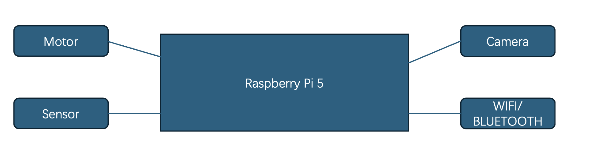

# Team18_Robot_Prj
# --------------------------------------------------------
### The Plant Protection Robot is based on Raspberry Pi 5

## Introduction
### 1.1 What is it?
The Plant Proetction Robot is a defender which be used to check the circumstance of the plant when the outside environment is not suitable for people to work. Like extreme weather and so on. Then people can remote control it to check the plant and do something else, such as cutting branches and leaves, and even sparing pesticides to drive away pests.

### 1.2 The structure:

#### Motor
We will use the DC Motors to as our driver to move our robot. Then using the step motors as the actuator of robotic arm.

#### Sensor
We will use Ultrasonic sensor to detect the obstacles to avoid crashing.

#### Camera
We will use the camera to do some real-time work, like monitoring or controlling.

#### Wifi/Bluetooth
We will use the wireless technology to make remote-control and monitoring come true.